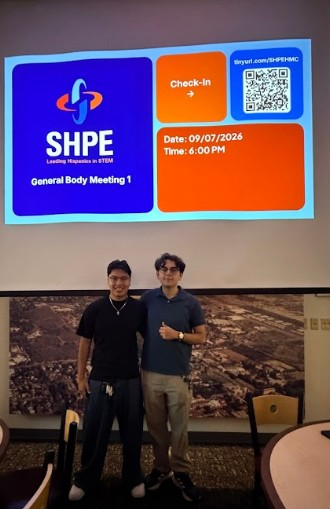
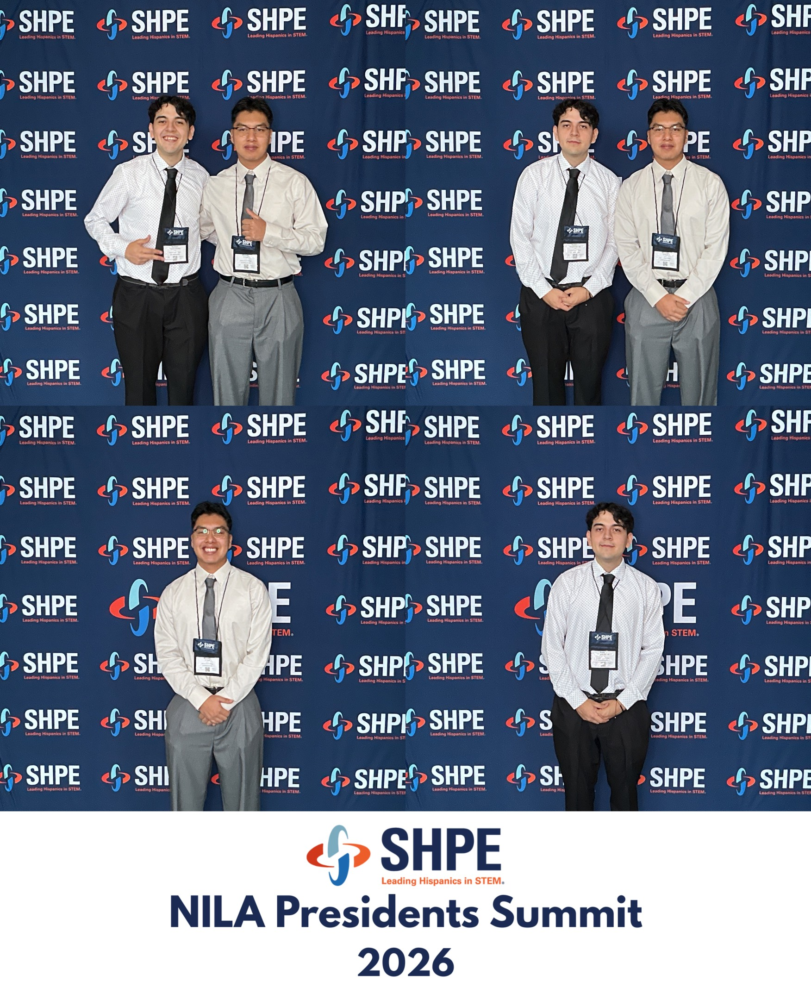

I have focused much of my campus leadership on building professional-development opportunities, strengthening community, and supporting students through their transition into college.

---

## Society of Hispanic Professional Engineers — Harvey Mudd College

**Founder & Chapter Co-President | January 2026 – Present**

I co-founded Harvey Mudd College's SHPE chapter to expand access to professional development, networking, and engineering opportunities for students across campus.

:::: {.columns}

::: {.column width="50%"}

*HMC SHPE co-presidents during the chapter's first general body meeting.*

:::

::: {.column width="50%"}

*HMC SHPE representation at a SHPE professional-development conference.*

:::

::::

### Building the Chapter

- Co-founded the Harvey Mudd SHPE chapter and established its initial leadership structure
- Grew chapter engagement to approximately **52 students**
- Developed professional-development programming centered on engineering careers, networking, and technical skills
- Built collaborations with campus departments and student organizations to expand opportunities for members

### National Convention & Funding

Working with my co-president, I helped secure approximately **$10,000 in first-year institutional funding** to support student attendance at the 2026 SHPE National Convention.

Funding efforts included outreach to:

- Harvey Mudd Engineering Department
- ASHMC
- Student Opportunity Fund
- Other institutional funding channels

We also developed an application and selection process to support **12 students** attending the national convention.

### Professional Development

Current chapter initiatives include:

- Technical portfolio and GitHub development
- Resume and career preparation
- Networking opportunities
- Engineering and professional panels
- Alumni and industry engagement
- Development of a future company sponsorship pipeline

### Skills Developed

**Organization Building • Fundraising • Professional Development • Event Planning • Team Leadership • Networking • Outreach**

---

## SALSA Mudd

**Club President | January 2025 – May 2026**

Led Harvey Mudd's Society of Professional Latinx in STEM organization, supporting community-building and academic and professional development.

- Led weekly meetings highlighting academic, professional, and campus opportunities
- Planned and executed **5+ cultural and social events per semester**
- Organized study sessions, cultural programming, movie nights, and community events
- Expanded collaboration with Latinx organizations across the five Claremont Colleges

---

## Mentorship & Student Support

### Orientation Mentor — Harvey Mudd College

**May 2026 – Present**

- Supported approximately **57 incoming students** during move-in, orientation, and their transition into the residential community
- Helped plan and execute multi-day orientation programming
- Continue to organize dorm events throughout the academic year to strengthen residential community

### Summer Institute Mentor — Harvey Mudd College

**August 2025 – May 2026**

- Directly mentored **three students** through their transition to Harvey Mudd
- Conducted recurring academic and personal check-ins
- Connected students experiencing academic difficulty with tutoring and campus resources
- Supported academic planning, belonging, and adjustment to college
- Connected mentees with affinity-group and community programming

### Latino Sponsor — Chicano-Latino Student Affairs

**August 2025 – May 2026**

- Mentored **five first-year students** through recurring one-on-one check-ins
- Supported conversations surrounding identity, belonging, academics, and adjustment to college
- Helped organize cultural and community programming including heritage celebrations, Día de los Muertos, cookouts, and other events across the Claremont Colleges

### Residential Counselor — Cal Poly Pomona Upward Bound

**Summer 2025**

- Supported Calculus and Precalculus instruction for approximately **31 high school students**
- Provided afternoon tutoring and academic support
- Lived residentially with program participants and helped maintain program expectations
- Directly mentored a group of **seven students**
- Planned recreational, creative, and college-preparation activities