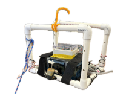
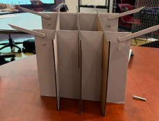
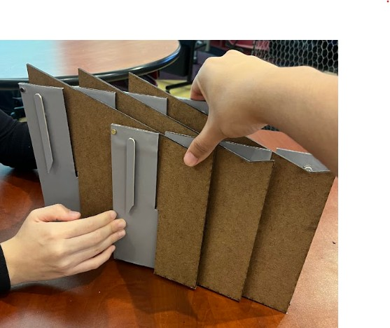
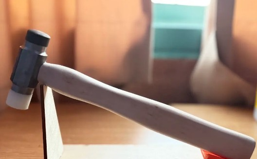

# Selected Engineering Projects

This page highlights engineering projects involving mechanical design, electronics, fabrication, instrumentation, controls, and experimental testing.

---

## Autonomous Underwater Vehicle — Spectral Light Attenuation Measurement System

**Harvey Mudd College | Spring 2026 | Team of 4**

Designed and deployed an autonomous underwater vehicle to investigate how visible light intensity and spectral composition change with depth in coastal waters near kelp ecosystems.

{width=65%}

*Final AUV integrating the structural frame, electronics housing, propulsion system, and environmental sensors.*

### My Work

- Designed and assembled the PVC structural frame and motor system
- Integrated electronic components into the underwater platform
- Designed and soldered circuitry for pressure and temperature sensing
- Integrated a **TCS34725 RGB sensor**, **MPX5700 pressure sensor**, and thermistor with a Teensy 4.1
- Implemented and tested autonomous depth-control behavior
- Collected and processed depth-resolved environmental measurements
- Supported coastal deployment and experimental troubleshooting

### Technical Report

The complete project report documents the vehicle design, sensor circuitry, calibration, autonomous control, coastal deployment, and experimental results.

[Open Full Project Report](files/Final_Report_William_Ortega.pdf){.btn .btn-primary target="_blank"}

<iframe
  src="files/Final_Report_William_Ortega.pdf"
  width="100%"
  height="800px"
  style="border: 1px solid #ddd; border-radius: 8px;">
</iframe>

### Tools & Skills

**Teensy 4.1 • MATLAB • Sensors • Circuit Design • Soldering • Data Acquisition • Feedback Control • Experimental Testing**

---

## Mobile Lectern — Client Design Project

**Harvey Mudd College | Fall 2025 | Team of 4**

Worked with a faculty client to design a lightweight, portable lectern that could be rapidly assembled and disassembled for classroom use.

:::: {.columns}

::: {.column width="50%"}

*Final assembled configuration.*

:::

::: {.column width="50%"}

*Collapsed configuration for portability.*

:::

::::

### Design Process

- Interviewed the client to identify functional and human-factors requirements
- Translated stakeholder needs into engineering specifications
- Developed and evaluated multiple design concepts
- Created SolidWorks models and engineering drawings
- Fabricated and tested iterative prototypes
- Evaluated setup time, portability, durability, and usability

### Final Design

The final design:

- Achieved an average setup time of approximately **1.6 seconds**
- Supported loads greater than **12 lb**
- Used a collapsible five-panel structure
- Included removable support wings and grip surfaces
- Was produced for approximately **$24 in prototype materials**

### Engineering Drawing Package

The final SolidWorks drawing package documents the complete assembly, individual panels, support wings, fabrication details, process routing, and bill of materials.

[Open Full Drawing Package](files/Mobile_Lectern_Drawings.pdf){.btn .btn-primary target="_blank"}

<iframe
  src="files/Mobile_Lectern_Drawings.pdf"
  width="100%"
  height="800px"
  style="border: 1px solid #ddd; border-radius: 8px;">
</iframe>

### Tools & Skills

**SolidWorks • Mechanical Design • Engineering Drawings • Prototyping • Fabrication • Client Communication • Design Testing**

---

## Hammer — Machining Project

**Harvey Mudd College | Fall 2025**

Fabricated a functional hammer from raw stock while developing precision machining and manufacturing skills.

{width=60%}

*Completed hammer fabricated from raw stock using manual machining processes.*

### My Work

- Machined hammer components using a mill and lathe
- Used a bandsaw and other shop equipment for stock preparation
- Worked from engineering drawings and specified dimensions
- Maintained required dimensional tolerances during fabrication
- Evaluated hardface hardness requirements after machining

### Tools & Skills

**Milling • Turning • Lathe • Bandsaw • Engineering Drawings • Measurement • Manufacturing**