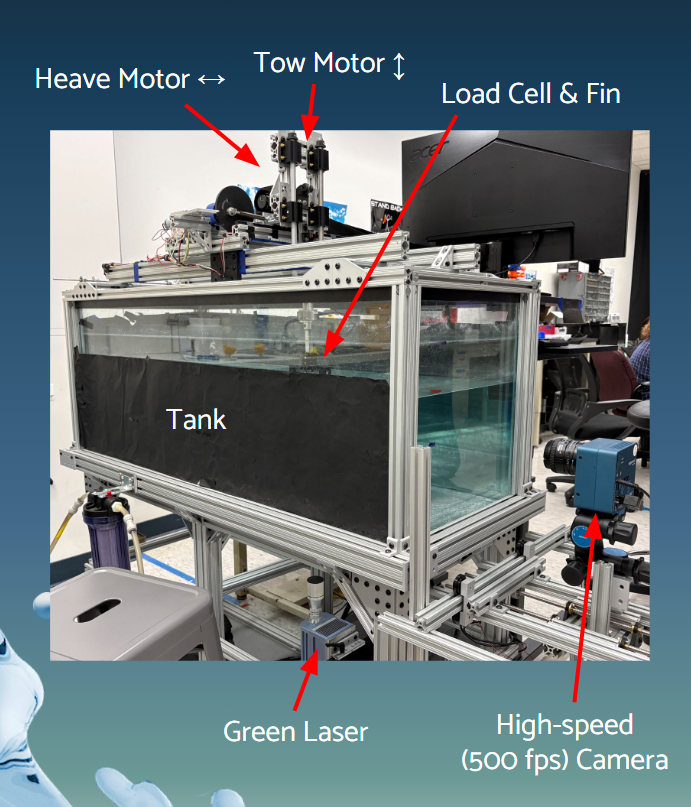

# Bio-Inspired Propulsion

## Flow Imaging Research Lab — Harvey Mudd College

I conduct experimental research in Harvey Mudd College's Flow Imaging Research Lab, studying **bio-inspired flapping-fin propulsion** and how fin geometry, orientation, operating conditions, and interaction with the free surface affect thrust production and wake dynamics.

My work combines **force measurement, high-speed imaging, Particle Image Velocimetry (PIV), experimental fixture design, and MATLAB-based data processing** to characterize propulsive performance across different fin configurations.

My current research focuses on **horizontal fully submerged fins and aspect-ratio effects**, with direct comparisons to previously studied vertical, surface-crossing configurations.

{width=85%}

## Research Focus

The project investigates how changes in fin geometry and operating conditions influence thrust production and wake structure.

Parameters I have investigated include:

- Actuation frequencies from **1–3 Hz**
- Fin thicknesses from **1/32 in to 1/8 in**
- Multiple fin aspect ratios and geometries
- Horizontal and vertical fin orientations
- Fully submerged and surface-crossing configurations
- Multiple submersion depths for surface-crossing fins

These experiments allow us to evaluate how both fin design and free-surface interaction influence propulsion performance.

## My Contributions

My work has included:

- Designing and modifying experimental fixtures for horizontal-fin testing
- Running **100+ horizontal-fin trials** across fin thickness, amplitude, and frequency
- Running **100+ surface-crossing trials** across aspect ratio, frequency, and submersion depth
- Maintaining flapping frequency within approximately **±0.02 Hz** for repeatable comparisons
- Measuring forces using an **ATI Mini40 six-axis load cell** and **NI DAQ**
- Redesigning MATLAB thrust-processing code for horizontal configurations
- Processing and comparing thrust coefficients across experimental configurations
- Setting up and positioning high-speed cameras
- Aligning the laser sheet used for Particle Image Velocimetry
- Adapting the PIV workflow for horizontal-fin experiments
- Processing velocity fields and examining wake and vortex structures in MATLAB using **PIVlab**

## Key Results

Across the configurations tested, fully submerged horizontal fins produced **higher thrust coefficients than surface-crossing fins in most cases**.

The highest measured thrust coefficient was approximately:

\[
C_T = 4.16
\]

for a **1/16-in-thick fin** in the horizontal, fully submerged configuration.

These results provide a direct experimental comparison between fully submerged and surface-crossing flapping-fin propulsion and help quantify how interaction with the free surface influences thrust production.

## Experimental Methods

### Thrust Measurement

Fin-generated forces are measured using an **ATI Mini40 six-axis force/torque sensor** connected through an **NI data-acquisition system**.

For each fin configuration, trials are performed across controlled combinations of geometry and operating conditions. The resulting force signals are processed in MATLAB to calculate thrust performance and nondimensional thrust coefficient.

To support horizontal-fin testing, I redesigned portions of the lab's existing thrust-processing pipeline.

This included:

- Remapping the measured force axis corresponding to thrust
- Revising inertial corrections using measurements from in-air trials
- Adapting the processing workflow for the horizontal experimental geometry
- Enabling direct thrust-coefficient comparisons between horizontal and vertical configurations

This processing pipeline allowed horizontal-fin results to be evaluated against the lab's existing vertical, surface-crossing experimental baselines.

### Particle Image Velocimetry

Particle Image Velocimetry is used to measure the velocity field generated by the oscillating fin and visualize the resulting wake.

My role in the PIV workflow includes:

1. Positioning and configuring the high-speed camera
2. Aligning the laser sheet with the measurement plane
3. Collecting high-speed image sequences
4. Processing experimental images in PIVlab
5. Correcting optical artifacts caused by reflections from the load cell
6. Analyzing velocity fields and trailing-edge vortex structures

For the horizontal configuration, I adapted the existing PIV workflow and implemented a **spline-based correction method** to reduce interference from load-cell reflections in the measurement region.

The resulting velocity fields allow us to connect changes in measured thrust with changes in wake structure and vortex formation.

## Aspect-Ratio and Surface-Crossing Experiments

A major portion of my current research investigates how **fin aspect ratio and free-surface exposure** affect propulsive performance.

For the surface-crossing experiments, I conducted more than **100 trials** while varying:

- Fin aspect ratio
- Flapping frequency
- Submersion depth from fully submerged to partially exposed configurations

By maintaining controlled operating conditions and consistent flapping frequency, these experiments allow thrust performance to be compared across different fin geometries and levels of free-surface interaction.

The resulting data are being analyzed alongside the horizontal-fin experiments to better understand the relationship between **fin geometry, submersion, thrust production, and wake dynamics**.

## Tools & Methods

**Experimental:** Particle Image Velocimetry (PIV), high-speed imaging, six-axis force measurement, NI data acquisition, laser alignment, experimental fixture design

**Analysis:** MATLAB, PIVlab, thrust-coefficient analysis, velocity-field processing, vortex/wake analysis

**Hardware:** ATI Mini40 six-axis load cell, NI DAQ, high-speed camera, laser-sheet PIV system

## Conference Presentation

I will present this research at the **APS Division of Fluid Dynamics Annual Meeting in November 2026**.

The presentation focuses on experimental results from **horizontal fully submerged fin configurations and fin aspect-ratio studies**, including comparisons of thrust performance and wake behavior across different operating conditions.